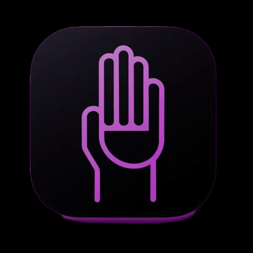
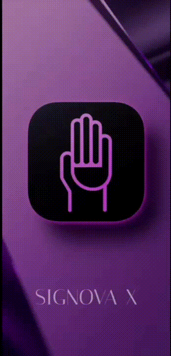
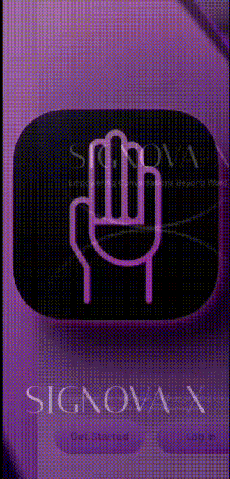
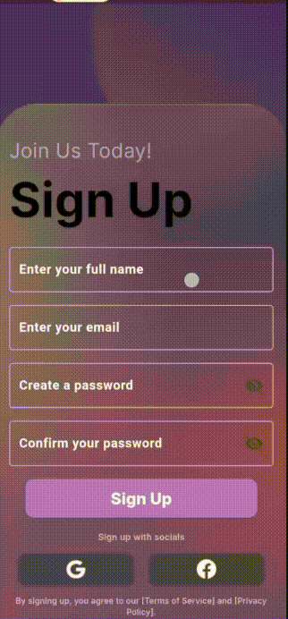
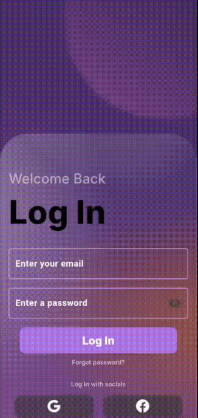
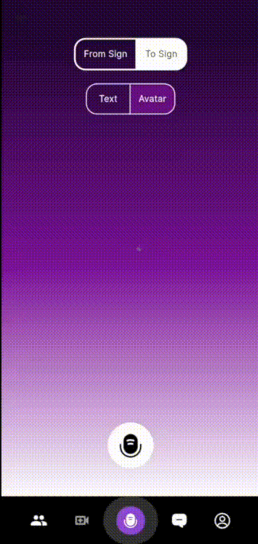
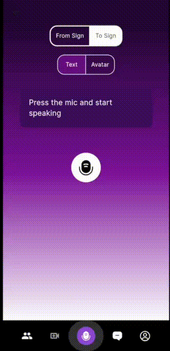
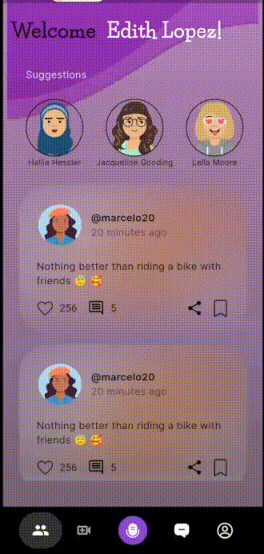
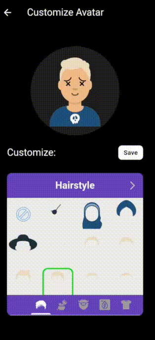
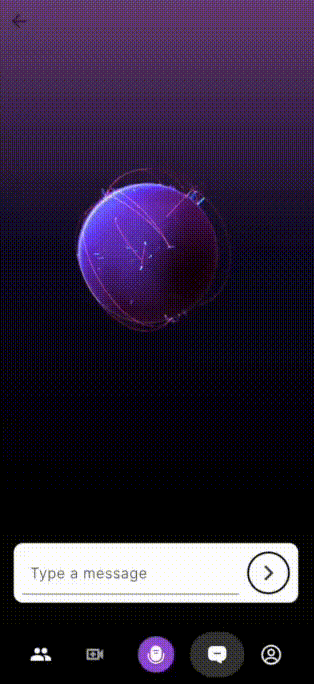

# 🚀 SIGNOVA-X 

It is an inclusive AI-powered application built to bridge the communication gap between the deaf/mute community and the hearing population. It enables real-time interaction by converting sign language into text and vice versa using deep learning, computer vision, and gesture recognition. Beyond communication, the app also offers AI-based friend suggestions based on user profiles, a motivational chatbot powered by Google Gemini for emotional support, and an SOS emergency feature. SIGNOVA-X is designed to empower, connect, and support individuals who rely on sign language—making digital communication more accessible, human, and inclusive.

[View our Figma Design](https://www.figma.com/design/8J4MSXWVIo1FAwGNq8wZAv/Solution_Challenge_Design?node-id=0-1&p=f&t=OVofSItuGbXo5Z4e-0)

---

## 🧩 Problem Statement

Despite advancements in technology, millions of deaf and mute individuals around the world still face significant barriers in everyday communication. From casual conversations and accessing emergency help to participating in online meetings and forming social connections, the lack of inclusive communication tools leads to isolation, misunderstanding, and exclusion.


The communication gap faced by deaf and dumb individuals significantly impacts their mental health, often leading to feelings of isolation, frustration, and low self-worth. Due to the lack of accessible communication tools and inclusive environments, around 72% of deaf and dumb individuals tend to avoid social gatherings. This avoidance stems from the fear of being misunderstood, excluded, or unable to express themselves freely. Over time, this social withdrawal contributes to increased loneliness, anxiety, and even depression, as these individuals are unable to form meaningful connections or participate fully in society. The absence of inclusive communication solutions not only limits their opportunities but also affects their emotional and psychological well-being.

Traditional methods like text messaging or human interpreters are not always accessible, affordable, or real-time. This communication gap not only limits personal and professional opportunities but also impacts emotional well-being and mental health.

There is a pressing need for an intelligent, accessible, and real-time solution that empowers deaf and mute individuals to communicate effortlessly, connect meaningfully, and feel supported—just like anyone else.

**SIGNOVA-X** addresses this gap by leveraging AI, computer vision, and natural language processing to build a bridge between sign language and spoken language, enabling seamless two-way communication and emotional support in an inclusive digital environment.


---

## ✨ Features


### 🔁 Real-Time Sign Language Translation
Enable seamless two-way communication between deaf/mute users and others. **SIGNOVA-X** captures live sign language video, extracts frames, and uses advanced AI models to convert it into accurate English text, fostering natural interactions.

### 🧑‍🤝‍🧑 Split-Screen Communication Interface
A dual-interface screen designed for real-time interactions. One side lets deaf users express through sign language, while the other allows hearing users to respond via voice, which is converted into sign actions by an animated avatar—ensuring fluid conversation.


### 🧠 Avatar-Based Sign Language Response
Using speech-to-text and NLP models, spoken input from hearing users is translated into sign language performed by a dynamic 3D avatar. This brings expressive communication to life, helping bridge emotional and social understanding.


### 🧬 AI-Powered Friend Suggestion System
SIGNOVA-X enhances social connectivity using an AI-driven profile-matching algorithm. During sign-up, users input hobbies, interests, and preferences, which are analyzed to recommend compatible friends and expand their social circles.

### 🧑‍⚕️ Mental Health Support Chatbot
Address emotional struggles and isolation with a 24/7 motivational chatbot tailored for the deaf community. It offers empathetic support to promote mental resilience and reduce feelings of loneliness.

### 🆘 Emergency SOS with Motion Trigger
In urgent situations, users can shake their phone three times to automatically alert emergency contacts and nearby authorities. The alert includes the user's live location, ensuring fast and silent assistance.

### 🗣️ Voice-to-Sign and Sign-to-Text Pipeline
Bidirectional communication powered by speech recognition and sign prediction. Supports both **sign-to-text** and **text-to-sign** flows for barrier-free, real-time conversations.

### 🧭 Personal Profiles with Preferences
User profiles store details like hobbies, favorite activities, and communication styles. These preferences personalize friend suggestions, chatbot tone, and overall app behavior for a tailored user experience.

### 💬 Inclusive and Accessible UI
A clean, intuitive interface built with accessibility in mind. Designed to accommodate motor and visual impairments, ensuring effortless use by all users.


### 🔐 Privacy-First Design
All user interactions—including sign, voice, and location data—are securely processed using end-to-end encryption. SIGNOVA-X follows strict privacy standards to keep your communication confidential.


---
<h3 align="center">App Demo</h3>

<p align="center">
  
  
  
  
</p>

---
<p align="center">
  
  
  
  
</p>

---
<p align="center">
  
  
  
</p>

---
##  Future Scope of SIGNOVA-X

At **SIGNOVA-X**, we’re committed to pushing the boundaries of accessibility, inclusion, and meaningful human connection. Below are the upcoming features and innovations we plan to integrate to further empower the deaf and mute community:

### Google Meet Integration for Inclusive Meetings
Imagine a virtual space where deaf individuals can actively participate in online meetings.

- Our upcoming **Google Meet Integration** will:
  - Detect sign language from the user's webcam in real time.
  - Convert it into spoken English audio for other participants.
- This ensures **seamless two-way communication** in both professional and social virtual settings.


### Name Recognition & Smart Vibration Alerts
Deaf individuals often miss cues like someone calling their name.

- Future versions of SIGNOVA-X will:
  - Use ambient sound detection to recognize when the user’s name is spoken nearby.
  - Trigger a gentle **vibration alert** on their phone.
- This feature helps users stay alert and engaged in their environment.


###  Therapist Support & Emotional Wellness
Many users silently struggle with loneliness, anxiety, or depression due to communication barriers.

- SIGNOVA-X aims to offer:
  - In-app access to **licensed therapists** trained in supporting people with disabilities.
  - Mental health resources and empathy-driven care within a safe space.


### Sign Language Learning Section
To foster inclusive communication for everyone:

- We’re developing a **sign language learning portal** featuring:
  - Video lessons
  - Quizzes and practice sessions
  - Interactive chats with an AI avatar
- This helps both deaf and hearing users become better communicators.


###  User Progress Tracker
Track and visualize your personal communication journey.

- A dynamic dashboard showing:
  - Improvements in fluency, vocabulary, and usage
  - Stats based on chatbot and real-time interaction history
- Encourages self-growth and celebrates progress.


### Multi-Language Support & Regional Sign Variants
Sign languages are not universal. To support global diversity:

- SIGNOVA-X will support:
  - Regional sign languages like **ISL, ASL, BSL**, and more.
  - Real-time translation of spoken languages into their **local sign language variants**.


### Community Volunteering & Listener Program
We envision a supportive community built on empathy.

- SIGNOVA-X will introduce:
  - A **volunteer listener program** connecting hearing individuals with deaf users.
  - Opportunities to offer support, companionship, or simply be a friend.

This initiative strengthens community bonds through shared conversations and mutual respect.

---


## 📖 How to Use SIGNOVA-X

**SIGNOVA-X** is designed to help deaf and mute individuals communicate, connect, and feel supported. Here's a simple step-by-step guide to get started and explore each powerful feature:

---

### 🛂 Step 1: Sign Up / Log In
Start by creating your account or logging in with your existing credentials.

- Provide your name, email, and password.
- Fill out your interests, hobbies, and communication preferences to personalize your experience.
- Add emergency contact details for SOS functionality.

---

### 🧑‍🤝‍🧑 Step 2:  🔄 Real-Time Split Screen Communication
Navigate to the **Live Communication** section of the app to experience **real-time two-way interaction** between deaf/mute and hearing users. This section is powered by advanced AI and gesture recognition technology and now features **two smart toggle options**:

### 🖐️ From Sign (Sign Language ➡️ Text)

- 🎥 Upon selecting the **"From Sign"** button, the **device camera opens**.
- 🔼 The **upper half** of the screen displays **live video input** of the user's hand gestures.
- 🧠 Using **AI models powered by MediaPipe & OpenCV**, SIGNOVA-X **analyzes gestures** in real time.
- 🔽 The **lower half** shows the **translated English text** corresponding to the recognized signs.
- ✅ Helps users with hearing/speech impairments **express themselves naturally** through sign gestures.


### 📢 To Sign (Text/Speech ➡️ Sign Language)

- 💬 The user can either **type a message** or **speak into the microphone**.
- 🧠 Input is processed through **speech-to-text** (if spoken) or parsed (if typed).
- 🧍‍♂️ An **animated avatar** visually replicates the message in **sign language**.
- 👁️‍🗨️ Enables deaf/mute users to **visually receive messages** in a fully accessible format.
- 🔁 Bridges the communication gap in a **seamless, inclusive, and intuitive** manner.

---

### 👥 Step 3: Build Your Profile & Connect
Go to the **Profile** section to update or view your personal info.

- Add interests such as music, movies, hobbies, or favorite topics.
- SIGNOVA-X uses this to recommend compatible users, helping you form meaningful friendships.

---

### 💬 Step 4: Chat with the Motivational Chatbot
Feeling down or alone? Navigate to the **Chatbot** section.

- Engage with our AI-powered chatbot trained to provide:
  - Emotional support
  - Motivational messages
  - Casual conversations tailored to your mood

Your 24/7 digital friend—always available to listen without judgment.

---

### 🆘 Step 5: Use the SOS Emergency Feature
In an emergency, when you can’t speak or type:

- Shake your phone **3 times quickly**.
- This sends an **SOS alert** to your emergency contacts and nearby police with:
  - A predefined emergency message
  - Your **real-time GPS location**

Get help instantly with a simple gesture—no words needed.

---

### 🌐 Step 6: Join the Community
Visit the **Community** section to engage with others.

- View AI-suggested friend recommendations.
- Chat with others or join group discussions.
- Share stories, experiences, and feel part of a supportive, inclusive environment.

---

### ✅ Step 7: Explore More
Stay tuned for exciting upcoming features:

- 📊 **Progress Tracker** – Track your communication improvements over time.
- 🤟 **Learning Section** – Practice and learn sign language at your own pace.
- 🗳️ **Feedback Portal** – Share ideas and suggestions to help shape SIGNOVA-X’s future.

---

## 🚀 Let's Get Started (Frontend Setup)

Follow the steps below to set up and run the **Flutter frontend** for the SIGNOVA-X application.

📝 Prerequisites
Before you start, make sure you have installed the following on your system:
Flutter SDK
VS Code
Dart and Flutter extensions for VS Code
Android emulator or physical device
Python 3.10.x

### 📥 1. Clone the Repository

```bash
git clone https://github.com/SIGNOVA-X/frontend.git
```
### 📁 2. Navigate to the Frontend Folder
```bash
cd frontend
```
## 🛠️ Environment Setup (.env)

To run the project locally, create a `.env` file in the root directory and add the following environment variables:
You can generate the google Generative AI API Key from [Google AI Studio](https://aistudio.google.com/prompts/new_chat)
For Pinata and Nagrok setup look at the backend repo

```env
# 🔑 Google Generative AI API Key
GENERATIVE_AI_APIKEY=""

# 📦 Pinata (IPFS) API Keys
PINATA_API_KEY=""
PINATA_SECRET_API_KEY=""

# 🌐 Ngrok Public URL for Backend Access
NGROK_URL=""
```
### 🛠️ 3. Get Flutter Dependencies
```bash
flutter pub get
```
### ▶️ 4. Run the Flutter App
```bash
 Run the Flutter App
```
## ✅ Conclusion

**SIGNOVA-X** is more than just a backend system — it's a step toward inclusive, AI-driven communication. By combining deep learning, computer vision, and generative AI, it empowers the deaf and mute community to connect, express, and engage with the world in real time. Whether it's through sign-to-text conversion, avatar-based animations, or mental health support, SIGNOVA-X ensures that technology serves everyone, equally.

We believe in a future where **communication has no barriers** — and this is just the beginning.

Feel free to explore, contribute, or get in touch to join us on this mission. 🤝✨

## 📚 Data Sources

- World Health Organization (WHO) - Causes of Hearing Loss
- Indian Deaf Association Survey 2023 - Social Isolation Among Deaf Individuals
